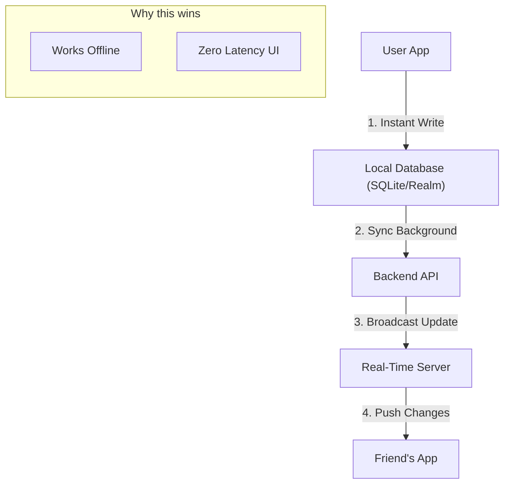

# Splitwise Clone: Comprehensive Market & Technical Analysis

## 1. Introduction
This document provides a deep-dive analysis of Splitwise, based on an algorithmic study of **16,634 negative reviews** and a structural examination of the app's current state. The goal is to define the blueprint for a superior competitor ("The Clone").

### What is Splitwise? (User-Perspective Architecture)
At its core, Splitwise is a **shared ledger**. It acts as a neutral third party that records who paid for what and calculates who owes whom.

**How it works (The User Journey):**
1.  **Creation:** User A creates a "Group" (e.g., "Trip to Vegas") and adds User B and User C.
2.  **Recording:** User A pays $150 for "Dinner". They select that this expense was "paid by A" and "split equally" among A, B, and C.
3.  **Calculation:** The system updates the *Net Balance*. A is owed $100 ($50 from B, $50 from C).
4.  **Simplification:** If B pays for a $30 Taxi later, the system offsets this against what B owes A.
5.  **Settlement:** User B "Settle Ups" by paying A via cash/Venmo, and records this payment in the app to zero out the balance.

## 2. Current Feature Set (The Baseline)
To compete, the clone must match these core features (MVP):

| Feature Category | Specific Functionality |
| :--- | :--- |
| **Expense Management** | Add expense, add photo (receipt), categorize (food, travel), add notes. |
| **Splitting Algorithms** | Equal (33/33/33), Percentage (50/25/25), Shares (2 parts vs 1 part), Adjustment (+/- amounts). |
| **Groups & Friendships** | Create groups for specific events. Maintain "Non-group" friendships for loose expenses. |
| **Debt Simplification** | *Crucial Algorithm.* Reduces circular debt (A owes B, B owes C -> A pays C directly). |
| **Activity Feed** | A timeline of who added/edited what (transparency is key for trust). |
| **Currencies** | Support for multiple currencies within the same group (auto-conversion is a "Pro" feature in Splitwise). |

## 3. The Analysis: Voice of 16,000 Users
We analyzed 16,634 reviews with ratings < 5. The data reveals exactly where Splitwise is failing.

### Category Breakdown
*   **Monetization (47.1%):** The primary driver of churn. Users feel "held hostage" by limits.
*   **Technical Stability (9.9%):** Significant complaints about sync delays and app "hanging".
*   **Authentication (4.7%):** Login loops and issues with phone number verification.
*   **UX/UI Friction (3.7%):** Users find the new interface cluttered or confusing.

### Major Pain Points & Limitations

#### A. Artificial Limitations (The "Pro" Wall)
These are features Splitwise *intentionally* broke or limited to force upgrades.
1.  **The Daily Limit (The #1 Killer):** Free users can only add **3 expenses per day**.
    *   *User Verdict:* "Useless for travel." A group eats breakfast, takes a taxi, and has coffee—limit reached by 10 AM.
2.  **The 10-Second Penalty:** A forced delay/ad before adding an expense.
    *   *User Verdict:* "Embarrassing." Standing at a counter trying to pay while the app counts down.
3.  **Charts & Graphs:** Visualizing spending habits is locked.
4.  **Currency Conversion:** Auto-converting EUR to USD is a paid feature.

#### B. Technical Limitations (The Hidden Opportunities)
These are issues likely due to technical debt or server load.
1.  **Sync Latency:** "I added the bill, but my friend doesn't see it yet." (Mentioned in ~1,600 reviews).
    *   *Clone Opportunity:* Prioritize WebSocket/Real-time database (e.g., Firebase/Supabase) for instant updates.
2.  **Login Loops:** Users getting stuck on "Verify Phone Number".
    *   *Clone Opportunity:* Offer simple "Email + Password" or "Google Auth" without forced phone verification.
3.  **Search:** Free users often struggle to search old history.
    *   *Clone Opportunity:* Client-side search is cheap to implement and high value.

## 4. Proposed Architecture for "The Clone"

### System Design (High Level)
To avoid the "Sync Latency" complaints, the architecture should be "Local-First" or "Real-Time First".

### The "Winning" Feature Strategy
Don't just copy. Improve where they failed.

| Feature | Splitwise Implementation | Clone Strategy (The Winner) |
| :--- | :--- | :--- |
| **Adding Expenses** | Limited to 3/day. 10s wait. | **UNLIMITED.** Instant. No ads on input. |
| **History Search** | Weak / Paid. | **Full Text Search** (Free). |
| **Graphs** | Paid "Pro" feature. | **Basic Charts Free** (Spending pie chart). |
| **Receipts** | Scan is Paid. Upload is Free. | **Receipt Storage Free.** (OCR can be a V2 feature). |
| **Export** | CSV export often paid/buried. | **One-click CSV/PDF Export.** |

## 5. Roadmap & Recommendations

### Phase 1: The "Exodus" MVP (Months 1-2)
Target the disgruntled "Traveler" and "Roommate" personas immediately.
*   **Goal:** A stable app that lets people add unlimited expenses.
*   **Tech:** Python/Django or Node/Express Backend. React Native or Flutter Mobile App.
*   **Marketing:** "The Unlimited Free Alternative to Splitwise."

### Phase 2: Technical Parity (Months 3-4)
*   **Debt Simplification Algorithm:** This is complex math (Min-cost max-flow problem). Must be robust.
*   **Multi-currency:** Fetch exchange rates once a day and cache them.

### Phase 3: The "Pro" Features (Monetization)
*   *Do NOT limit expenses.*
*   **Monetize:**
    *   Complex Export (Tax ready reports).
    *   AI Receipt Scanning (Costly to run, fair to charge for).
    *   Cloud Storage for high-res receipt images.

## 6. Conclusion
The analysis confirms a classic "SaaS over-optimization" failure. Splitwise squeezed their free tier too hard, turning their biggest asset (the network effect of free users) into a liability.

By building a clone that simply **removes the limits** and ensures **reliable sync**, you will capture a significant portion of their market share. The bar is currently set low: "Just let me add my dinner bill."